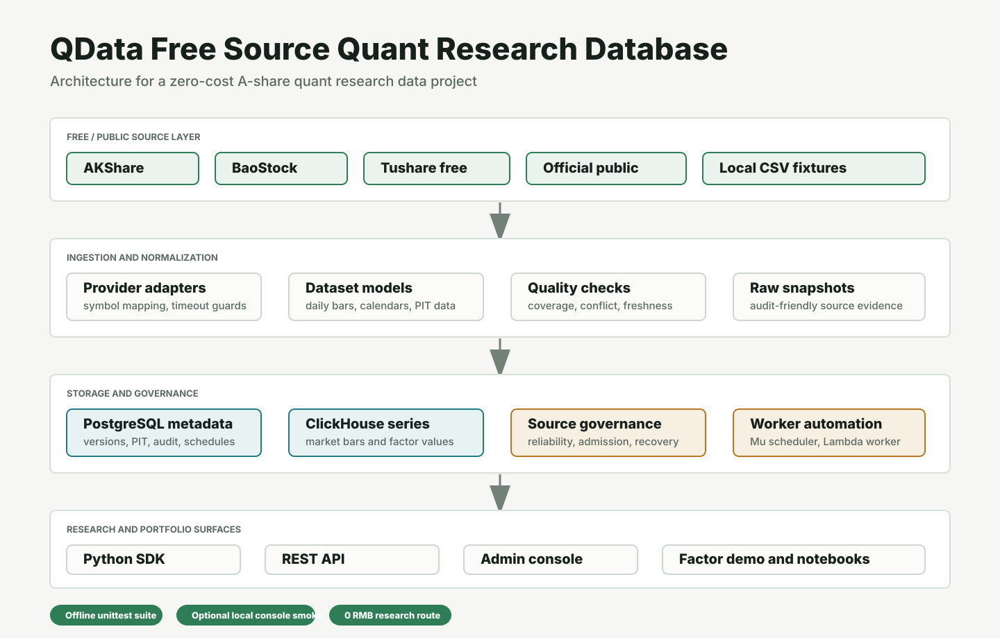

# QData Free Source Quant Research Database

QData is a zero-cost A-share quant research database project. It is designed as a practical data engineering project: free-source adapters, quant-ready dataset modeling, point-in-time research APIs, source reliability governance, worker automation and an admin console.

The current goal is not to claim commercial-grade market data redistribution. Instead, QData demonstrates how to build a rigorous research data stack from free/open/public sources while keeping licensing and production-source boundaries explicit.

## Highlights

- Python SDK for market prices, trading calendars, PIT fundamentals, index members, industry classification, universes and factors.
- PostgreSQL metadata layer for dataset versions, audits, worker schedules, governance snapshots and API operations.
- ClickHouse time-series layer for market bars and factor values.
- Free-source fabric covering AKShare, BaoStock, Tushare free tier, official public pages and local CSV fixtures.
- Reliability scoring, admission review, recovery actions and health monitoring for free data sources.
- REST API and Upsilon admin console for observability.
- A tiny factor backtest demo that runs without Docker or paid data.

## Project Page

The GitHub Pages site lives in [`docs/index.html`](docs/index.html). To publish it:

1. Push the repository to GitHub.
2. Open `Settings -> Pages`.
3. Select `Deploy from a branch`.
4. Choose branch `main` and folder `/docs`.

## Quick Start

Run the SDK quickstart:

```bash
python3 examples/quickstart.py
```

Run the factor backtest demo:

```bash
python3 examples/factor_backtest_demo.py
```

Expected demo shape:

```text
QData factor backtest demo
universe=hs300 factor=momentum_20d signal_date=2024-01-02 hold_date=2024-01-03
tradable_symbols=2 long_bucket=600519.SH short_bucket=000001.SZ
long_return=... benchmark_return=... active_return=... factor_spread=...
```

Run unit tests:

```bash
python3 -m unittest discover -s tests
```

The latest local verification output was:

```text
Ran 291 tests ... OK
upsilon_console=ok html_bytes=807462 markers=73
health=ok rows=1
price=ok rows=2
constraints=ok rows=2
tradable=ok rows=2
matrix_csv=ok lines=2
```

## Architecture



## Free Source Strategy

QData treats free sources as research, validation and fallback candidates:

| Source | Research role | Governance boundary |
|---|---|---|
| AKShare | Daily bars, symbols, calendars and public datasets | Research/validation first; upstream terms must be reviewed before commercial use |
| BaoStock | Historical A-share data candidate | Network timeout guard and recovery workflow required |
| Tushare free tier | Quota-limited supplementary checks | Token is optional and never committed |
| Official public pages | Exchange, announcement and macro candidates | Cache, attribution and redistribution rules remain explicit blockers |

## Factor Demo

The demo ranks the tradable HS300 mock universe by `momentum_20d` on `2024-01-02`, buys the top-ranked stock for one day, and compares it with an equal-weight benchmark.

This is intentionally tiny. Its purpose is to show the research workflow:

1. Build a tradable universe.
2. Pull point-in-time factor values.
3. Pull forward-adjusted prices.
4. Rank symbols by factor signal.
5. Compute next-period strategy, benchmark and active returns.

The code is in [`examples/factor_backtest_demo.py`](examples/factor_backtest_demo.py), and the notebook version is in [`notebooks/free_source_factor_backtest.ipynb`](notebooks/free_source_factor_backtest.ipynb).

## Project Boundary

Free sources are useful for learning, research and validation. A commercial production data service still needs licensed primary data, written redistribution rights, SLAs and legal review. QData keeps that boundary explicit through source admission profiles and governance checks.
